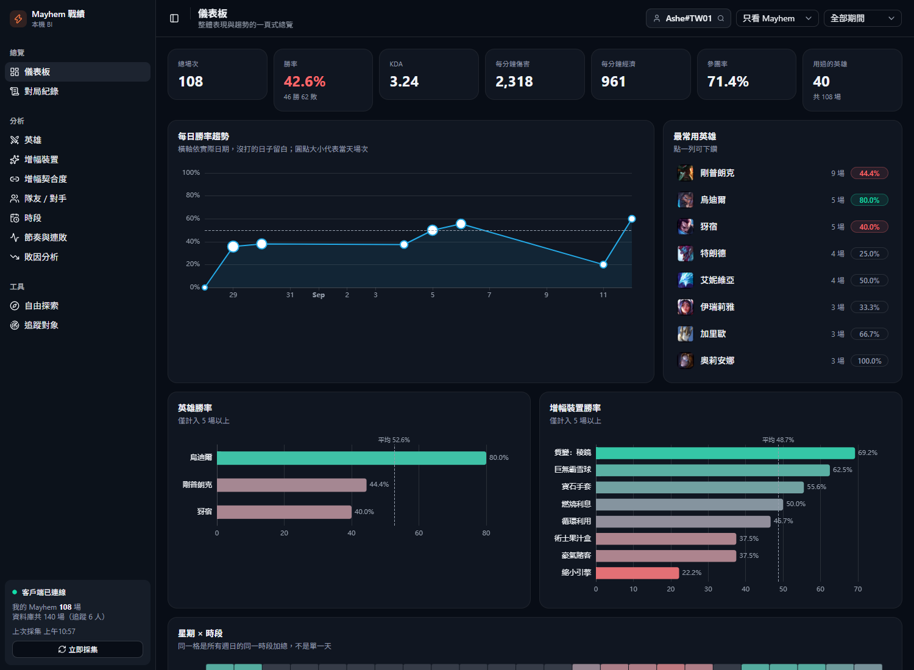
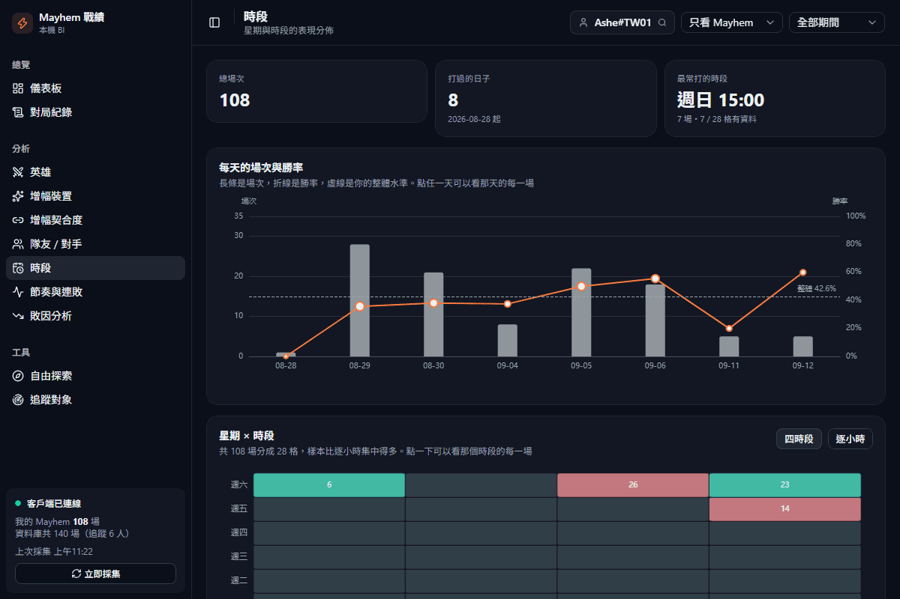
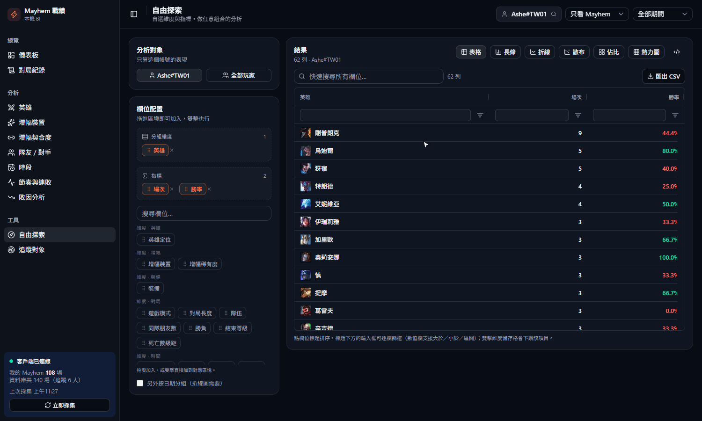
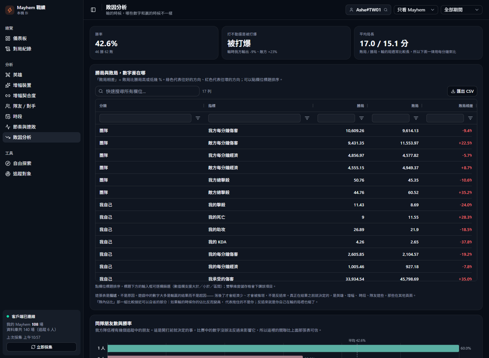
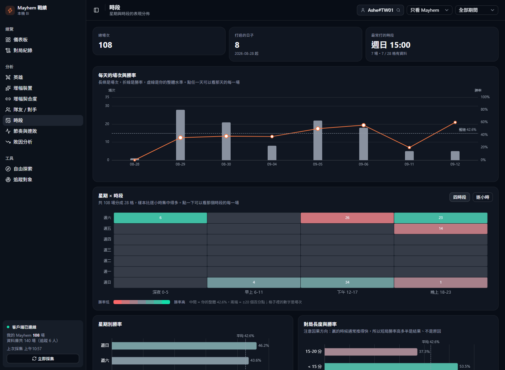
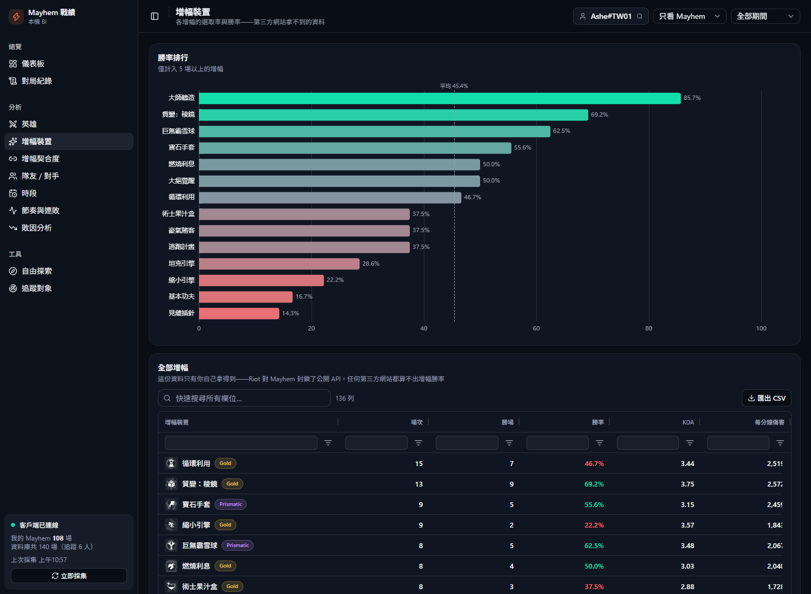

# Mayhem 戰績

在自己的電腦上，把 ARAM: Mayhem 的對戰紀錄自動存下來並做分析。

**為什麼要自己存？** Riot 官方 API 對 Mayhem 直接回 403（[官方說這是刻意的](https://github.com/RiotGames/developer-relations/issues/1109)），
所以 op.gg、u.gg 都查不到任何人的 Mayhem 戰績。而遊戲客戶端只留最新 100 場——
**被擠出去的對局就永遠消失了**。這個工具就是趁資料還在的時候把它接住。



## 快速開始

需要 [uv](https://docs.astral.sh/uv/) 和 [Node.js](https://nodejs.org/)。

```bash
uv sync
cd cube && npm install && cd ..
uv run app.py
```

打開 <http://127.0.0.1:5057>。League 客戶端開著（停在大廳就行）它就會自動採集，不用按任何按鈕。

<details>
<summary>建議再做一件事：擋掉 Cube 的對外連線</summary>

Cube 沒有繫結位址的設定，它的三個埠一律開在所有網路介面上，而開發模式不驗證身分。
前端已經改走 FastAPI 代理，但那些埠本身仍然開著。用**系統管理員**執行一次：

```powershell
New-NetFirewallRule -DisplayName "Mayhem: 封鎖 Cube 對外連線" -Direction Inbound -Protocol TCP -LocalPort 4000,3030,15432 -Action Block
```

不影響本機使用，Windows 防火牆不過濾 loopback。
</details>

## 畫面

### 一路挖下去：圖表 → 那一天的每一場 → 單場完整戰報



點每日圖裡的某一天，就列出那天的每一場；再雙擊一列，就是那場 10 個人的完整戰報
（出裝、增幅、KDA、經濟）。熱力圖的格子也可以這樣點。

### 自由探索：換個圖表型態看同一份資料



維度和指標可以拖曳配置，右上角隨時切換表格／長條／散布／佔比。

### 敗因分析——輸的時候，哪些數字和贏的時候不一樣



比較一律用每分鐘，不用總量：敗局平均 17.0 分、勝局 15.1 分，光時間差就會讓敗局的雙方總傷害都變高。
除完之後才看得出「我方輸出掉 9%、敵方多 23%」——被打爆的成分大於打不動。

### 時段——什麼時候打、什麼時候贏



熱力圖的顏色錨在你自己的平均勝率，而且會依樣本多寡收斂：一場 100% 的格子顏色很淡，
場次夠多才會真的往兩端跑。點任一天或任一格，就列出那一塊的每一場，再點進去看完整戰報。

### 增幅裝置——第三方網站給不了的資料



指標定義集中在語意層，自由探索的選單直接由模型產生——模型裡加一個指標，那頁就多一個選項。

## 全部分頁

| 分頁 | 看什麼 |
|---|---|
| 儀表板 | 場次、勝率、KDA、每分鐘傷害與經濟、每日趨勢 |
| 對局紀錄 | 逐場瀏覽，點進去看 10 人完整戰報（出裝、增幅、數據） |
| 英雄 | 每隻英雄的場次、勝率、KDA、傷害佔比、參團率 |
| 增幅裝置 | 各增幅的選取次數與勝率 |
| 增幅契合度 | 哪些增幅特別適合哪隻英雄 |
| 隊友 / 對手 | 和誰同隊會贏、遇到誰會輸；點進去看和某人同場時的英雄與定位拆解 |
| 時段 | 每天的場次與勝率、星期 × 時段熱力圖 |
| 節奏與連敗 | 上一場的結果、當日第幾場對表現的影響 |
| 敗因分析 | 勝局與敗局的數字對照、同隊朋友數與勝率 |
| 自由探索 | 維度與指標自選，可拖曳配置、可看產生的 SQL |
| 追蹤對象 | 除了自己以外，還要一併採集誰的戰績 |

表格都可以排序、逐欄篩選、匯出 CSV。雙擊維度可以下鑽——例如點某隻英雄，
再切到其他分頁就只看這隻英雄。

## 架構

```
League 客戶端 ──LCU API──> FastAPI（採集器 + 靜態站台）──> SQLite mayhem.db
                              │                                    ↑
                              └── /api/cube 代理 ──> Cube 語意層 ───┘
                                        ↓
                            React + shadcn/ui + AG Grid + ECharts
```

只有一個行程要顧：`uv run app.py` 會一併把 Cube 拉起來。
指標定義集中在 `cube/model/cubes/`，所以「勝率」在每一頁的算法保證一致。

<details>
<summary>採集怎麼運作（含冪等性）</summary>

兩層保險：

- **即時層（每 30 秒）**——監看客戶端狀態，偵測到「剛打完一場」就立刻採集。
- **補漏層（每 5 分鐘）**——固定掃最新 100 場清單補缺，兜住工具沒開、當機、客戶端重啟。

去重靠三層，重複執行不會產生重複資料：

1. 先查資料庫已有哪些 `game_id`，已知的連明細都不用抓
2. 寫入用 `INSERT OR IGNORE`，主鍵是 `(platform_id, game_id)`
3. 整場包在單一 transaction 裡

每場的**原始 JSON 也會完整存下來**。舊資料無法重抓，將來想分析目前沒解析的欄位時只能靠它——
目前資料庫裡有 20 幾個欄位就是後來靠這份備份補回去的。
</details>

<details>
<summary>開機自動啟動（Windows）</summary>

已註冊排程工作 `MayhemStatsCollector`，登入後 30 秒以隱藏視窗啟動，執行 [autostart.pyw](autostart.pyw)。

```powershell
Get-ScheduledTaskInfo -TaskName MayhemStatsCollector   # 看上次執行狀況
Disable-ScheduledTask -TaskName MayhemStatsCollector   # 暫時停用
Enable-ScheduledTask  -TaskName MayhemStatsCollector   # 恢復
Unregister-ScheduledTask -TaskName MayhemStatsCollector -Confirm:$false   # 移除
```

服務已經在跑時再手動執行一次不會出事——`autostart.pyw` 偵測到 port 5057 被佔用就自己退出。
</details>

<details>
<summary>資料存在哪</summary>

專案目錄下的 `mayhem.db`（SQLite）。**裡面的舊資料無法重建，建議偶爾備份。**

| 表 | 內容 |
|---|---|
| `matches` | 對局表頭 + 原始 JSON + 本地時間欄位 |
| `match_participants` | 每場 10 人的完整數據 |
| `participant_augments` / `participant_items` | 長格式，方便統計 |
| `dim_*` | 英雄／增幅／裝備的名稱與圖示對照 |
| `ingest_runs` | 採集稽核紀錄 |

時間欄位（`local_date` / `local_weekday` / `local_hour`）是採集時就用本地時區算好存進去的。
不能留給查詢層算——Cube 的 server 行程跑在 UTC 下，SQLite 的 `'localtime'` 在那裡等於 UTC，
時段分析會整個偏移。
</details>

<details>
<summary>改前端</summary>

原始碼在 `web/`。**建置產物 `web/dist` 有一起進版控**，所以平常執行不需要 npm：

```bash
cd web && npm install && npm run build
```

開發時可以 `npm run dev`（另一個埠），API 會自動代理到 5057。
</details>

<details>
<summary>找不到客戶端 / 連線失敗</summary>

- 確認 League 客戶端**正在執行**（登入大廳就可以）。
- 工具會自動嘗試 Windows / Mac 的常見安裝路徑。
- 剛重開過客戶端的話 lockfile 會變，採集器下一輪自動重讀，不用手動處理。
- 客戶端沒開時工具照常可用，只是英雄和增幅的圖示會空白——那些圖檔是即時跟客戶端要的。
</details>

## 隱私

所有運算和儲存都在你自己的電腦上，不會把任何資料送到任何伺服器。

資料庫裡會有同場其他玩家的名稱（做隊友分析的必要資料），一樣只留在本機。

**上面的截圖與 GIF 裡，所有玩家名稱都是假的**——錄製時在 API 層就換成假名了，
不是事後修圖。隊友頁和對局列表這種會整排列出他人帳號的畫面，一律不放進 repo。
